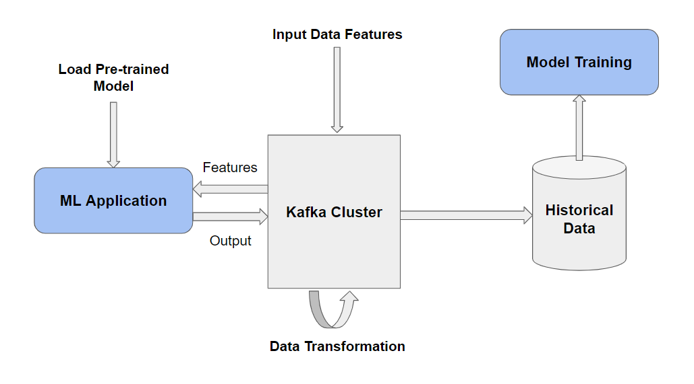

# Streaming-ML-Pipelines

## Getting Started
For illustration purposes and to focus more on taking Machine Learning models into production, we will be using data from the *Store Item Demand Forecasting's Kaggle Competition*. The objective of this competition is to predict 3 months of item-level sales data at different store locations. 

A Jupyter Notebook containing some exploratory data analysis and an implementation of a simple LSTM model can be found [here](./store-item-demand-forecasting-lstm.ipynb).

## Model Deployment
The following architecture demonstrates the different components involved and their interactions:



To deploy the service, run the following commands:
```
cd model-deployment

./docker-build.sh

./docker-start.sh
```
