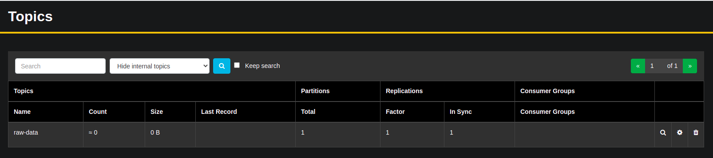

# Streaming-ML-Pipeline

## Getting Started
For illustration purposes and to focus more on taking Machine Learning models into production, we will be using data from the *Store Item Demand Forecasting's Kaggle Competition*. The objective of this competition is to predict 3 months of item-level sales data at different store locations. 

A Jupyter Notebook containing some exploratory data analysis and an implementation of a simple LSTM model can be found [here](./store-item-demand-forecasting-lstm.ipynb).

## Setup

1. Create a new docker network by running ``` docker network create -d bridge kafka-stack-network```

2. Start the following services by running ``` docker-compose up -d ```:
    
    - Zookeeper
    - Kafka 
    - Schema Registry
    - AkHQ

## Data Generation

1. Create a new topic called ```raw-data``` by accessing AKHQ, a kafka management GUI, using ``` https://localhost:8080```



2. Build and start the datagen docker container which will produce some test data to kafka by running the following commands:
```
cd datagen

./docker-build.sh

./docker-start.sh
```

## Model Deployment
The following architecture demonstrates the different components involved and their interactions:


To deploy the service, run the following commands:
```
cd model-deployment

./docker-build.sh

./docker-start.sh
```
